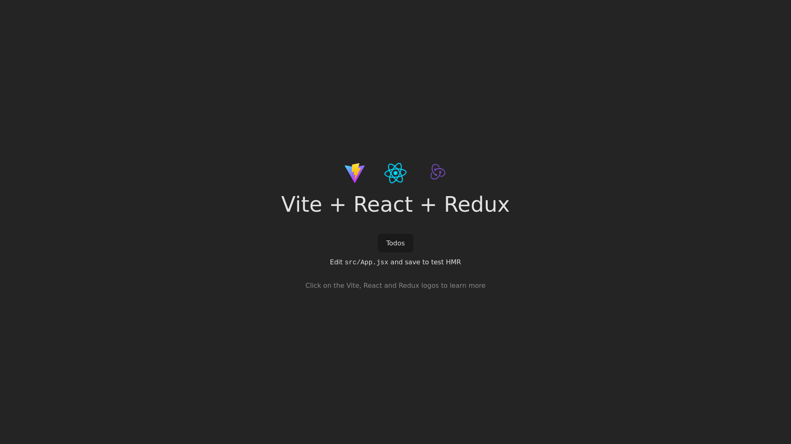

    updated on: 25th September 2024, Wednesday

<div align=center>
    <a href="https://reduux.vercel.app" target="_blank">
        
    </a>
    <p style="font-family: roboto, calibri; font-size:12pt; font-style:italic"> A repository to learn redux </p>
    <a src="https://github.com/warmachine028/redux/forks" target="_blank">
        
    </a>
</div>

# [Redux](https://github.com/warmachine028/redux)

![line]

## Table of Contents

- [Introduction](#introduction)
- [Getting Started](#getting-started)
- [Tech Stack Used](#tech-stack-used)
- [Preview](#preview)
- [Best Contributors](#best-contributors)
- [License](#license)

![line]

## Introduction

- A repository to learn redux using react & vite

## Getting Started

```sh
> cd client
> npm i
> npm run dev
```

![line]

## Tech Stack Used

- Git/GitHub
- JavaScript
- React
- Vite
- Redux
- Vercel
- React Router Dom
- Tailwind CSS
- ESLint
- Prettier
- CSS

          

![line]

## Preview



![line]

## Best Contributors

<div align="center">
    <a href="https://github.com/warmachine028/redux/graphs/contributors" target="_blank">
        
    </a>
</div>

![line]

## License

- See [LICENSE]

**Pritam Kundu, 2024**

![line]

## Thank you, everyone 💚

[icons]: https://icons8.com/
[markdown-badges]: https://github.com/Ileriayo/markdown-badges
[line]: https://user-images.githubusercontent.com/75939390/137615281-3a875960-92cc-407f-97fe-fd2319bdb252.png
[License]: https://github.com/warmachine028/redux/blob/main/LICENSE

<!-- 25/09/24 -->
